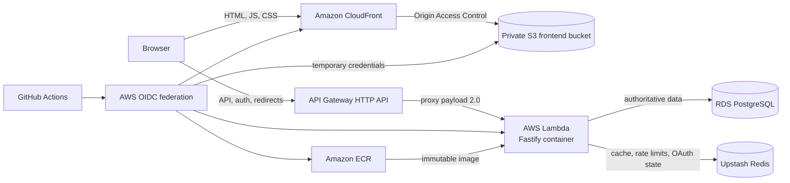

# Architecture

Ushly separates a static React frontend from a Fastify API. They are built and
deployed independently and communicate through the configured public API origin.

## Component responsibilities

| Component | Responsibility |
| --- | --- |
| React/Vite frontend | Public pages, authentication UI, dashboard, admin UI, localization, accessibility, and safe API decoding. |
| CloudFront | Public HTTPS endpoint, CDN delivery, custom domains, caching, and SPA fallback behavior. |
| Private S3 bucket | Stores generated static frontend files without public bucket access. |
| API Gateway HTTP API | Public API endpoint and Lambda proxy integration. |
| Lambda/Fastify | Validation, authentication, authorization, business rules, and safe HTTP responses. |
| PostgreSQL/Prisma | Source of truth for users, identities, sessions, links, clicks, roles, and audit events. |
| Redis | Redirect cache, shared rate-limit state, link-creation limits, and single-use Google OAuth state. |
| GitHub Actions/OIDC | Reproducible checks and short-lived, least-privilege AWS deployment credentials. |

## Main request flows

### Frontend delivery

The browser requests a localized route from CloudFront. CloudFront serves a
prerendered page or asset from the private S3 origin through Origin Access
Control. React takes over client routing after hydration. The generated
`200.html` is the SPA fallback; `robots.txt` and `sitemap.xml` must remain direct
objects rather than fallback responses.

### Authentication and API calls

The frontend calls `VITE_API_ORIGIN`. API Gateway converts the request to a
Lambda proxy event, and `@fastify/aws-lambda` invokes the same Fastify app factory
used by local `src/server.ts`. Access tokens remain in browser memory. The
host-only HttpOnly refresh cookie is sent only under `/auth`, while PostgreSQL
stores only refresh-token hashes and rotation relationships.

### Redirect and analytics

The redirect service checks a versioned Redis cache and falls back to PostgreSQL
on a miss, malformed value, or cache error. Only active, unexpired links redirect.
The backend then attempts an awaited click write containing an HMAC IP digest and
bounded referrer/user-agent data. A click-write failure is safely recorded and
does not change the redirect response.

## Authority and failure boundaries

PostgreSQL is authoritative. Redis improves performance and coordinates limits
and OAuth state; it must never overwrite or contradict persistent link state.
Cache failures fall back to PostgreSQL where safe. Rate-limit and OAuth-state
failures fail closed because bypassing them would weaken security. Database
errors become safe public responses without connection or driver details.

`GET /health` and `GET /health/live` are dependency-free liveness endpoints.
`GET /health/ready` probes PostgreSQL and Redis and returns `503` when either is
unavailable. Liveness therefore remains observable during an outage without
claiming the instance is ready for traffic.

## Independent releases

Frontend releases synchronize `frontend/dist` to S3 and invalidate CloudFront.
Backend releases publish an immutable ECR image and update Lambda. Database
migrations are a separate manual step. Releases should preserve API and schema
compatibility long enough to roll either application artifact back safely.
