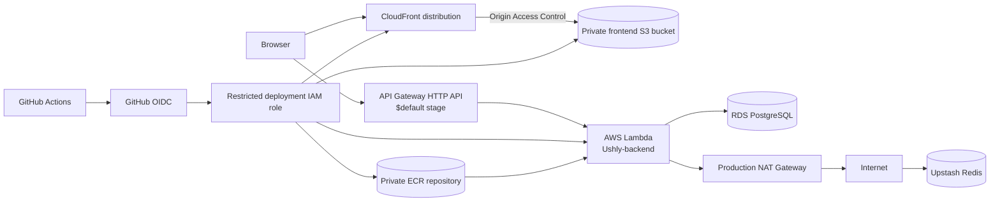

# Deployment and operations

This document describes Ushly's production architecture and release procedure.
The application runs in AWS **Europe (Stockholm), `eu-north-1`**, with Namecheap
DNS and external Upstash Redis. Repository inspection verifies the application
artifacts and GitHub workflows; live DNS, AWS, Upstash, Google Cloud, backup,
alarm, and billing configuration remain manual operational checks.

No account-specific identifiers or credentials belong in this file. Commands use
logical names and placeholders such as `<aws-account-id>`.

## 1. Deployment overview

The React/Vite frontend and Fastify backend deploy independently:

- CloudFront serves the frontend from a private S3 bucket through Origin Access
  Control (OAC). Namecheap hosts DNS for the main domain and optional `www` alias.
- API Gateway HTTP API exposes `api.ushly.net` and forwards catch-all routes from
  the automatically deployed `$default` stage to the `Ushly-backend` Lambda.
- Lambda runs the ECR container built by `backend/Dockerfile.lambda` inside
  private VPC subnets. It reaches private RDS directly and external Upstash Redis
  through a public NAT Gateway.
- PostgreSQL is authoritative. Redis supports redirect caching, shared rate
  limiting, link-creation limits, and temporary OAuth state. Redis failure must
  never mutate or contradict PostgreSQL state.
- Production deployment follows successful CI on a push to `main`. GitHub OIDC
  provides temporary credentials to a restricted deployment role.

The architecture is not zero-cost. RDS and NAT Gateway are recurring costs even
at low traffic, and the other services have storage, request, transfer, log, or
plan-based charges.

## 2. Architecture diagram



## 3. AWS services and responsibilities

| Service | Ushly responsibility and selection | Trade-offs, cost, and operational limits |
| --- | --- | --- |
| **Namecheap** | Hosts authoritative DNS records for the frontend domains and API subdomain. It keeps domain registration/DNS separate from AWS compute. | Domain renewal is recurring. DNS validation and propagation are manual, and supported alias record types depend on Namecheap. |
| **AWS Certificate Manager (ACM)** | Supplies managed TLS certificates. The frontend CloudFront certificate is in `us-east-1`; the regional API certificate is in `eu-north-1`. | Public certificates avoid manual renewal when validation remains valid. Region placement, domain coverage, and DNS validation must be maintained. |
| **Amazon S3** | Stores `frontend/dist` in a private bucket. Static storage is simple, durable, and independent of backend availability. | Storage, request, and transfer usage can charge. S3 does not provide SPA routing by itself, and public bucket access must remain blocked. |
| **Amazon CloudFront** | Terminates frontend HTTPS, provides custom domains and CDN delivery, caches objects, and applies the SPA fallback. | Requests, transfer, and invalidations may charge. Cache behavior, error responses, and certificate association require manual validation. |
| **Origin Access Control** | Authenticates CloudFront requests to S3 so the bucket can stay private. It solves direct-public-bucket exposure. | The bucket policy must be restricted to the intended distribution and updated when that relationship changes. |
| **API Gateway HTTP API** | Exposes the public API domain and converts HTTP requests into Lambda proxy payload format 2.0. HTTP API was selected as the direct serverless entry point. | Requests are usage based. Catch-all routes, `$default` stage, automatic deployment, custom-domain mapping, CORS, and payload format must match the application. |
| **AWS Lambda** | Runs Fastify from the container handler and reuses module-scope Prisma/Redis clients on warm invocations. It avoids managing a long-running API server. | Cold starts and one connection set per concurrent environment matter. Memory, timeout, reserved concurrency, and database capacity require measurement; no availability or scaling target is claimed. |
| **Amazon ECR** | Stores private Lambda images with immutable commit SHA tags. It gives Lambda a versioned, native-dependency-compatible artifact. | Image storage and transfer may charge. Retention/lifecycle cleanup must preserve enough prior images for rollback. |
| **Amazon RDS PostgreSQL** | Stores users, Google identities, links, refresh sessions, roles, click analytics, and audit data. It is the persistent source of truth. | Instance, storage, I/O, and backup retention are recurring concerns. Pooling, maintenance, backup verification, and restoration are operator responsibilities. RDS remains private. |
| **Amazon VPC** | Provides the private network shared by Lambda and RDS and separates private workloads from public egress infrastructure. | Network design adds routing and troubleshooting complexity. VPC attachment does not give Lambda internet access by itself. |
| **Private subnets** | Host Lambda network interfaces and RDS without direct internet routes. | They require explicit routes to NAT for outbound internet traffic. Lambda must never be described as running in a public subnet. |
| **Public NAT subnet** | Hosts the public NAT Gateway and routes it to the Internet Gateway. | It is public only because its route table reaches the Internet Gateway; application workloads do not run there. |
| **Route tables** | The public table routes `0.0.0.0/0` to the Internet Gateway. Private Lambda subnet tables route outbound internet traffic to the NAT Gateway. | A missing or incorrect association causes timeouts. Routes should be reviewed per subnet and kept minimal. |
| **Internet Gateway** | Connects the public NAT subnet to the internet. | It does not make private Lambda or RDS public. Public exposure still depends on subnet routes and resource configuration. |
| **NAT Gateway** | Gives private-subnet Lambda outbound access to Upstash and Google OAuth/provider endpoints. | It has ongoing hourly and data-processing costs and can dominate a low-traffic portfolio bill. It is required by this topology because Redis is external. |
| **Security groups** | The Lambda group controls function traffic; the RDS group accepts TCP 5432 from the Lambda group and temporary migration access only. | Rules are stateful but must be managed carefully. Broad CIDRs and permanent operator access are inappropriate. |
| **CloudWatch** | Receives Lambda/runtime logs used for startup and request diagnostics. | Log ingestion and retention may charge. Retention, metric filters, alarms, access controls, and query-string restrictions are manual configuration. |
| **Upstash Redis** | Provides externally hosted Redis instead of ElastiCache for cache, rate limits, and OAuth state. | It has plan limits, external-network latency, credentials, and NAT egress dependency. It is not durable application storage; PostgreSQL remains authoritative. |
| **GitHub Actions** | Runs backend/frontend CI and the production deployment workflow. | Runner usage and workflow supply-chain controls require review. Production runs only after the tested `main` commit succeeds. |
| **GitHub OIDC** | Lets Actions exchange a signed identity for temporary AWS credentials. It removes long-lived AWS access keys from GitHub. | The AWS trust policy must exactly restrict repository, branch, audience, and role assumptions. Incorrect claims prevent deployment or over-broaden trust. |
| **AWS IAM** | Separates the GitHub deployment role from the Lambda execution role and grants each only its required operations. | Least-privilege policies require ongoing maintenance. Root-account credentials are reserved for account recovery and exceptional account-level operations, not routine deployment. |

## 4. DNS and TLS

Namecheap holds records for the main frontend domain, optional `www` alias, ACM
DNS validation, and the API subdomain. Do not copy AWS-generated IDs into public
documentation.

Frontend TLS requirements:

1. Request an ACM certificate in **`us-east-1`** covering the main domain and
   optional `www` name.
2. Create the ACM validation records in Namecheap and wait for issuance.
3. Attach the certificate and both alternate domain names to CloudFront.
4. Point the frontend DNS records to the CloudFront distribution using the
   record type Namecheap supports for the zone apex and `www`.

Backend TLS requirements:

1. Request a regional ACM certificate in **`eu-north-1`** for the API subdomain.
2. Create the Namecheap validation record and wait for issuance.
3. Attach it to the API Gateway custom domain.
4. Map that domain to the HTTP API's `$default` stage and create the Namecheap
   API record for the API Gateway regional target.

The backend `GOOGLE_OAUTH_REDIRECT_URI` must exactly match
`https://<api-domain>/auth/google/callback`, and that exact value must be
registered in Google Cloud Console. Repository code cannot verify the live DNS,
certificate status, domain mapping, or provider console.

## 5. Frontend deployment

The frontend S3 bucket is private, has Block Public Access enabled, and is not an
S3 public website. CloudFront uses the bucket origin through OAC; the bucket
policy grants read access only to the intended distribution.

CloudFront configuration:

- Default root object: `index.html`.
- Alternate names: main domain and optional `www` alias.
- ACM certificate: frontend certificate in `us-east-1`.
- SPA behavior: the current production distribution maps the relevant 403/404
  responses to `/index.html` so direct client-route requests load React.
- Static files such as assets, `robots.txt`, and `sitemap.xml` must remain direct
  objects and must not be accidentally replaced by the SPA response.

The repository also generates `dist/200.html`; the actual CloudFront deployment
uses `/index.html` for its SPA fallback. Keep documentation and distribution
behavior aligned if this choice changes.

The workflow supplies public build-time values:

```text
VITE_SITE_ORIGIN=https://<frontend-domain>
VITE_API_ORIGIN=https://<api-domain>
```

Vite embeds these values into browser assets; they are not secret variables.
The workflow runs the production build, synchronizes the contents of
`frontend/dist` to `s3://<s3-bucket-name>/` with obsolete-object deletion, then
invalidates `/*` on `<cloudfront-distribution-id>`. An origin change requires a
new build, not only a cache invalidation.

## 6. Backend deployment

The backend Lambda function is logically named **`Ushly-backend`** and uses a
private ECR container image in `eu-north-1`. Build only with:

```bash
cd backend
npm run build:lambda-image
```

`Dockerfile.lambda` uses the official AWS Lambda Node.js 22 base image. Its
runtime entrypoint is inherited as `/lambda-entrypoint.sh`, and its command is:

```text
dist/lambda.handler
```

The build script checks the entrypoint, handler command, and AMD64 architecture.
The regular `backend/Dockerfile` starts `dist/server.js` and opens an HTTP
listener. An early Lambda deployment used that server image, so Lambda waited
for a runtime handler and timed out. The fix was the Lambda-specific base image,
entrypoint, and handler. Never deploy the regular server image to Lambda.

The production workflow builds a local tag tied to the tested commit, pushes:

```text
<aws-account-id>.dkr.ecr.eu-north-1.amazonaws.com/<ecr-repository>:<commit-sha>
```

and updates `<lambda-function-name>` to that exact URI. It publishes the update
and waits with `aws lambda wait function-updated-v2`. Do not use a mutable
`latest` tag as the release identity. The image includes compiled JavaScript,
production dependencies, Prisma Client and required native modules; secrets are
runtime configuration and are never baked into the image.

API Gateway uses Lambda proxy payload format 2.0, an automatically deployed
`$default` stage, and catch-all routes that preserve application paths and query
strings. The API custom domain needs an API mapping to that stage. A certificate
and DNS record alone do not perform the mapping.

## 7. VPC and networking

Lambda and RDS are in the **production VPC** in `eu-north-1`. Lambda attaches to
private Lambda subnets and the Lambda security group. RDS remains in private
database subnets and is never made publicly accessible.

Required paths:

- Lambda → RDS: private VPC routing; RDS security group ingress TCP 5432 with
  **Lambda security group** as the source.
- Lambda → Upstash/Google: private subnet default route → production NAT Gateway
  in the public NAT subnet → public subnet route table → Internet Gateway.
- Internet → Lambda: API Gateway invokes Lambda through AWS integration; there is
  no direct public subnet address on the function.

Two production failures demonstrated these boundaries:

1. RDS was unreachable until Lambda and RDS used matching VPC connectivity and
   the RDS security group admitted PostgreSQL from the Lambda group.
2. Upstash timed out after Lambda entered private subnets. Adding a public NAT
   Gateway, Internet Gateway route, and the NAT route on each Lambda private
   subnet route table restored external egress.

The NAT Gateway is not optional while private Lambda must reach external Upstash
and Google. It remains an ongoing fixed and usage-based cost consideration.

## 8. RDS and Prisma migrations

RDS PostgreSQL is the source of truth for persistent users, identities, refresh
sessions, roles, links, clicks/analytics, and audit events. Redis state must
never replace these records. Keep RDS private, configure backups and retention
manually, and test restoration before claiming a recovery capability.

Neither Lambda initialization nor `.github/workflows/deploy.yml` runs migrations.
Production migrations were applied manually from a temporary VPC-connected EC2
instance. Another controlled private method is acceptable when documented.

Migration procedure:

1. Review the committed migration and compatibility with both current and prior
   Lambda images. Take an appropriate backup.
2. Launch or use a temporary instance in the production VPC. Prefer Session
   Manager when its role and network access are configured; avoid routine public
   SSH.
3. Temporarily allow TCP 5432 from the migration instance security group to the
   RDS security group.
4. Supply `DATABASE_URL` securely at runtime, for example
   `postgresql://<database-user>:<database-password>@<rds-host>:5432/<database>`.
   Do not store it in source, documentation, user data, or shell history.
5. Checkout the intended release, install locked backend dependencies, and run:

   ```bash
   cd backend
   npx prisma migrate deploy
   ```

6. Run the admin bootstrap only when explicitly needed for an existing account.
7. Verify migration status and `/health/ready`.
8. Remove the temporary security-group rule and terminate temporary migration
   infrastructure.

Never substitute `prisma db push` for production migrations. Application image
rollback does not undo database changes.

## 9. Upstash Redis connectivity

Upstash Redis is external to AWS and replaces ElastiCache in this architecture.
`REDIS_URL` is configured only in the Lambda runtime using a value containing
the required TLS endpoint and `<upstash-token>`; never expose it through Vite,
GitHub logs, commands committed to the repository, or documentation.

Redis supports redirect cache-aside behavior, shared/global route limits,
link-creation counters, and single-use OAuth state. Cache read/write failure may
fall back to PostgreSQL for redirects. Security-sensitive rate-limit and OAuth
state operations fail closed. In no case may Redis failure corrupt persistent
PostgreSQL state.

`GET /health/ready` checks both PostgreSQL and Redis. `GET /health` and
`GET /health/live` check only process/application liveness. Upstash reachability
therefore depends on Lambda private-subnet NAT routing, DNS, TLS, valid runtime
credentials, and the external service plan.

## 10. GitHub Actions and OIDC

`.github/workflows/ci.yml` runs for pull requests and pushes to `main`. It uses
locked installs, PostgreSQL 16 and Redis 7 test services, and separate repository,
backend, and frontend checks.

`.github/workflows/deploy.yml` starts only after the named CI workflow succeeds
for a push to `main`, then checks out the exact tested SHA. The frontend and
backend jobs independently obtain temporary AWS credentials with GitHub OIDC.
No long-lived AWS access keys are stored in GitHub.

The OIDC trust relationship initially failed until its repository and `main`
branch claims matched the workflow. The trust policy should restrict the issuer,
`sts.amazonaws.com` audience, repository identity, and intended branch or
protected environment. The deployment permissions must also cover each exact
resource and operation used by the workflow.

The **GitHub deployment role** uploads S3 objects, invalidates CloudFront, pushes
ECR images, and updates/waits for Lambda. The **Lambda execution role** is assumed
by `Ushly-backend` at runtime for logging, VPC network-interface access, and any
approved runtime AWS access. They are separate trust boundaries and must not be
confused or reuse broad policies.

Routine releases use the GitHub role. Do not recommend root-account use for
deployment, migration, application operation, or daily IAM work.

## 11. Required repository variables

The deployment workflow requires GitHub repository variables, not secrets:

| Variable | Expected value |
| --- | --- |
| `AWS_REGION` | `eu-north-1` |
| `AWS_ROLE_ARN` | ARN of the restricted GitHub OIDC deployment role. |
| `VITE_SITE_ORIGIN` | Exact public HTTPS frontend origin. |
| `VITE_API_ORIGIN` | Exact public HTTPS API origin. |
| `S3_BUCKET` | `<s3-bucket-name>` without `s3://`. |
| `CLOUDFRONT_DISTRIBUTION_ID` | `<cloudfront-distribution-id>`. |
| `ECR_REPOSITORY` | `<ecr-repository>` without registry or tag. |
| `LAMBDA_FUNCTION` | `Ushly-backend` or the function ARN. |

Backend runtime secrets and settings belong in Lambda configuration or an
approved secret service. They include `DATABASE_URL`, `REDIS_URL`,
`GOOGLE_CLIENT_SECRET`, `JWT_SECRET`, `IP_HASH_SECRET`, cookie settings, exact
CORS origins, and the OAuth redirect URI. Use placeholders such as
`<database-password>`, `<upstash-token>`, `<google-client-secret>`,
`<jwt-secret>`, and `<ip-hash-secret>` in documentation.

Credentials exposed in a log, issue, terminal capture, artifact, or document
must be revoked or rotated; deleting the visible copy is not sufficient.

## 12. Required IAM permissions

The GitHub deployment role needs only the operations exercised by the workflow:

- S3 bucket listing plus object read/write/delete for the frontend bucket.
- `cloudfront:CreateInvalidation` for the CloudFront distribution.
- `ecr:GetAuthorizationToken`, repository upload-layer actions, and
  `ecr:PutImage` for the private ECR repository.
- `lambda:UpdateFunctionCode` and the Lambda read actions required by the update
  waiter for `Ushly-backend`.

Scope resource ARNs wherever AWS supports it. `ecr:GetAuthorizationToken`
requires `Resource: "*"`; do not use that limitation to broaden other actions.
The role does not need permissions to modify RDS, VPC, Lambda environment
variables, IAM policies, DNS, ACM, or Prisma migrations.

The Lambda execution role needs CloudWatch log delivery and the standard VPC
network-interface permissions required for VPC-attached Lambda. Add any further
runtime AWS permissions only when an implemented feature needs them. It does not
need GitHub deployment permissions.

## 13. Health checks and verification

After infrastructure or release changes:

1. Request `/health`; it must return 200 without PostgreSQL or Redis access.
2. Request `/health/ready`; it returns 200 only when PostgreSQL and Redis probes
   succeed, and a safe 503 otherwise.
3. Confirm API Gateway catch-all paths, `$default` automatic deployment, custom
   domain API mapping, and public HTTPS callback behavior.
4. Inspect CloudWatch Lambda initialization and request logs without copying
   secrets, cookies, authorization headers, or OAuth query values.
5. Verify registration, login, refresh, logout, Google OAuth/linking, owned link
   CRUD, redirect, QR, analytics, and administrator authorization.
6. Verify main and `www` frontend domains, direct SPA routes, static assets,
   `robots.txt`, sitemap, localized metadata, and CloudFront cache behavior.
7. Inspect Secure, HttpOnly, host-only, SameSite, and path cookie attributes
   without exposing values.

The repository cannot verify live DNS, ACM issuance, CloudFront policies, API
mappings, IAM trust, RDS backups, CloudWatch retention, billing alarms, Upstash
limits, or Google Cloud callback registration. Record these as manual checks.

## 14. Rollback procedures

- **Frontend:** preserve or rebuild the previous tested `frontend/dist`, sync it
  back to the S3 bucket, and invalidate CloudFront. Invalidation alone does not
  restore overwritten/deleted objects; S3 versioning can simplify recovery when
  enabled and tested.
- **Lambda image:** update `Ushly-backend` to the prior immutable ECR SHA image,
  publish, wait for completion, and run health/smoke checks. Retain prior images
  long enough to make this possible.
- **Lambda configuration:** restore the separately recorded previous runtime,
  VPC, concurrency, timeout, memory, role, and environment settings. An image
  rollback does not change configuration.
- **Failed workflow:** determine which independent job changed production and
  roll back only that artifact. Do not assume both jobs completed atomically.
- **Database:** an application rollback does not reverse Prisma migrations.
  Prefer additive backward-compatible changes. Use a reviewed forward fix or a
  tested backup restoration plan; do not improvise destructive down migrations.

## 15. Cost-control checklist

- Configure AWS Budgets and billing alerts; alarms notify but do not automatically
  stop resources.
- Review the NAT Gateway's hourly and processed-data charges regularly.
- Review RDS instance, storage, I/O, backup retention, and snapshot growth.
- Apply ECR lifecycle rules while retaining rollback images.
- Set deliberate CloudWatch log retention and avoid verbose sensitive logging.
- Review S3 storage/requests, CloudFront requests/transfer/invalidations, Lambda
  duration/invocations, API Gateway requests, and Upstash plan usage.
- Terminate temporary EC2 migration instances and remove their security-group
  access immediately after migrations.
- Remove unused Elastic IPs, NAT Gateways, snapshots, test resources, certificates,
  and distributions only after checking dependencies and recovery needs.

Do not claim the environment is free. Exact costs vary by usage, region, plans,
tax, retention, and data transfer and must be checked in the live accounts.

## 16. Manual operational checklist

- [ ] Confirm Namecheap records and ACM validation for every frontend/API name.
- [ ] Confirm CloudFront OAC bucket policy, default root object, `/index.html`
      fallback, aliases, certificate, and cache behaviors.
- [ ] Confirm API Gateway catch-all routes, payload format 2.0, `$default`
      automatic deployment, custom-domain API mapping, and regional certificate.
- [ ] Confirm Lambda uses the intended immutable image, handler, execution role,
      private subnets, security group, timeout, memory, and bounded concurrency.
- [ ] Confirm RDS is private, backups/retention are configured, and ingress 5432
      is limited to Lambda plus explicitly temporary migration access.
- [ ] Confirm every private Lambda subnet routes external traffic through the
      production NAT Gateway and the public NAT subnet routes to the Internet
      Gateway.
- [ ] Confirm Upstash TLS connectivity, plan limits, and runtime-only credentials.
- [ ] Confirm Google callback, exact CORS origins, and production cookie settings.
- [ ] Confirm GitHub OIDC trust claims and least-privilege deployment permissions.
- [ ] Confirm CloudWatch log access/retention and configure required alarms.
- [ ] Perform health and application smoke checks after releases.
- [ ] Test backup restoration before describing recovery as verified.
- [ ] Rotate any credential exposed in logs or documentation.

## 17. Known limitations

- This is a single-region design; no multi-region or availability objective has
  been measured or established.
- Lambda cold starts, concurrency, Prisma connection behavior, and RDS capacity
  need production measurement and may require pooling or concurrency changes.
- NAT Gateway is a recurring cost and a required egress dependency in the current
  private-subnet/external-Redis architecture.
- Upstash is an external dependency; Redis outage affects readiness, limits, and
  OAuth state even though it must not corrupt PostgreSQL.
- CI/CD does not run production database migrations and frontend/backend deploy
  jobs are not one atomic transaction.
- Alerting, CloudWatch retention, backup restoration, secret rotation, and full
  incident procedures require manual configuration and practice.
- Repository tests do not verify external DNS, certificates, AWS policies, live
  OAuth configuration, billing, performance, scalability, or availability.
